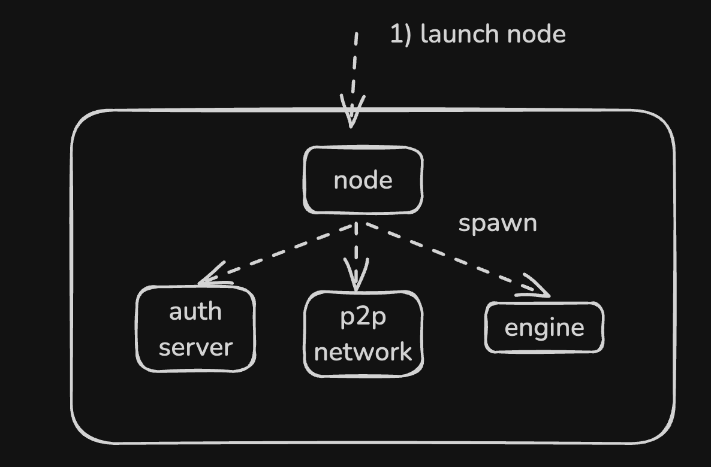
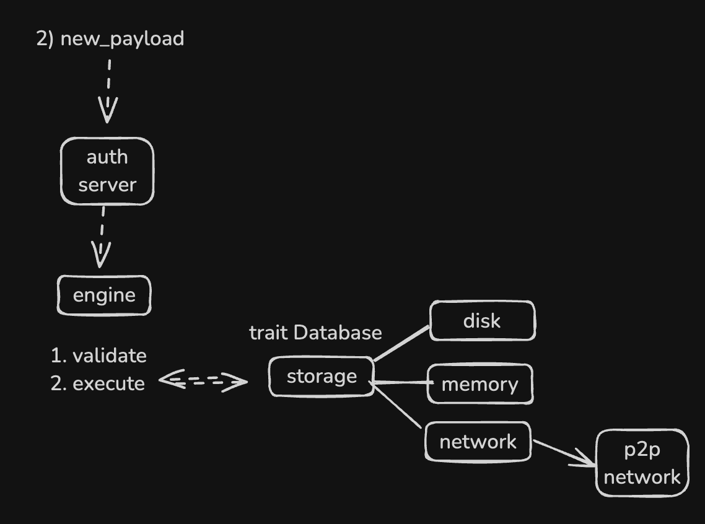
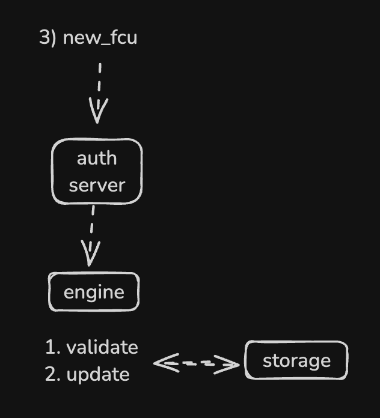

# ress(reth stateless)

# ress(reth stateless)

## Scenario

Before a new ress node can join the network, the network must already be formed with at least 1 reth (subprotocol implemented) node and 2 ress nodes. These 2 ress nodes should all be synced via the reth node.

The new ress node is then spawned to join the network. It should quickly discover the reth node with the subprotocol.

The first step is to prefetch A. 256 canonical block hashes, B. the parent block header to memory.

Then, via the message sent from the consensus client, the ress node requests witness data from the network. It then performs validation and execution of this new payload given the witness that turns into a spare trie. While executing, it determines the necessary contract bytecode and gets it from disk, then falls back to request it from the network - the reth node. The disk is just a simple KV storage that can get bytecode from the code hash.

The consensus client then sends a new fork choice message, and the ress node performs a validation check and updates the node and storage state. It also removes the witness and any unnecessary block data that is stored in memory.

The ress node then continues to sync.


## run

- reth with subprotocol
```console
RUST_LOG=info cargo run -r --bin reth node --authrpc.port 8651 --http.port 8544 -d --trusted-peers enode://4d4b6cd1361032ca9bd2aeb9d900aa4d45d9ead80ac9423374c451a7254d07662a3eada2d0fe208b6d257ceb0f064284662e857f57b66b54c198bd310ded36d0@127.0.0.1:61398
```

- ress
```console
RUST_LOG=info cargo run -r --bin ress -- --remote-peer "enode://060bb5ab4a20bbb2465a4db24de7a740db00207e34044454504bf004d6396bd9b03bf08b1df3f1f468366a2c0b809dee7aa54069af94fa11bdb26b9103ee76d6@127.0.0.1:30303" --no-debug-consensus 2
```

### 1. launch ress node

Spawning 3 process.
- authserver: `EngineApi` implemented server to listen consensus message.
- p2p network: spawn network that implemented `ress-protocol`.
- engine: `ConsensusEngine` that spawned to keep receive message




### 2. new payload

Authserver received the message and validate payload scaleton. Send to `ConsensusEngine` and handle logic of further validation - against the parent header, construct Executor and run evm and post validation with receipt.

Storage is abstracted in 3 different backend, disk, memory, network.




### 3. new fcu

validate message and update the state of node.




## run
ress <> ress && reth(stateful reth) <> ress && reth <> reth (this is reth impl)(x)

- test_uils (peer1)
```console
RUST_LOG=info cargo run --bin ress 1
```

- test_uils (peer2)
```console
RUST_LOG=info cargo run --bin ress 2
```


## component

- binary
  - [reth](./bin/reth): run original reth client that added custom subprotocol to communicate with ress
  - [ress](./bin/ress): run resss client - stateless execution client

- crates
  - [ress-common](./crates/common): ress common
  - [ress-network](./crates/network): provide functions to spawn authserver and network.
  - [ress-node](./crates/node): provide abstraction of launch the node and inner consensus engine implementation
  - [ress-storage](./crates/storage): provide abstraction of storage that handles 3 backends (disk, in memory, network) based on request.
  - [ress-vm](./crates/vm): provide executor that can execute evm from new block
  - [subprotocol](./crates/subprotocol/)
