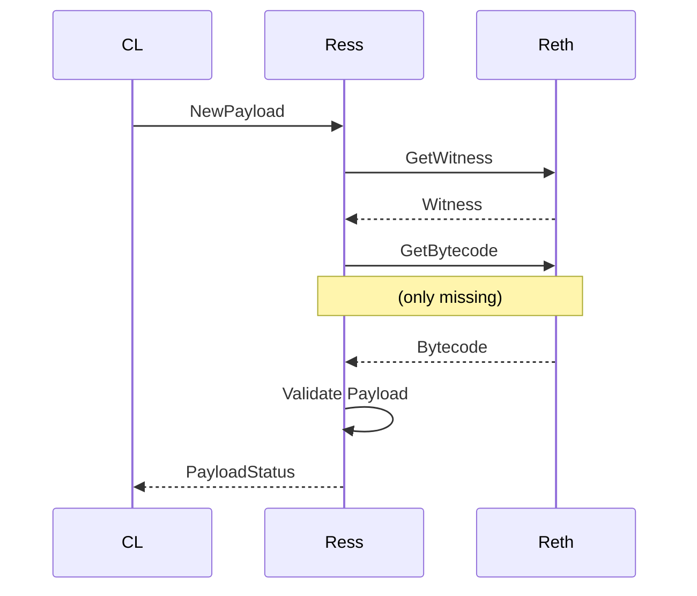

# ress(reth stateless)

Ress (shorthand for: Reth Stateless), a fully validating stateless Ethereum Execution Layer with 14GB disk requirements. Stateless nodes matter not only for improving Ethereum’s decentralization, but also to scale the L1 gas limit, scaling optimistic L2s, and for implementing Native Rollups to improve the L2 ecosystem’s security & interoperability.

## Run

To run ress you need to either start a reth stateful node with `--ress.enable` to enable support for `ress` subprotocol or connect to a node which already has support enabled. You will need to provide the trusted peer manually:

```bash
cargo r --bin ress --profile profiling -- --debug.debug-consensus-url wss://reth-ethereum.ithaca.xyz/ws --remote-peer enode://ea6ac5192e6321f91eece5aeb6185e6b289f20dbc693c0f4b0abd299997b56227407f26ae1af5c3f05d00b9c743938e7afaf835709a956e01ebd980723caf1f8@103.50.32.176:30303
```

To fetch the enode from a reth node you can do 
```bash
cast rpc admin_nodeInfo -r http://localhost:9545 | jq .enode
```

## How it works

Live sync works like any other stateful node: Ress fetches new payload from consensus and fetches necessary state data (witness, block, bytecodes) from a stateful reth client via [RLPx subprotocol dedicated to Ress](https://github.com/paradigmxyz/reth/tree/main/crates/ress/protocol).



## How it was tested

### Hive Tests 

Ress was tested with [hive](https://github.com/ethereum/hive). A simulator sends requests to `adapter`, which proxies `engine/*` request to `ress`, and other requests to `reth`. 

- `reth`: auth port(8651), rpc port(8544), subnetwork(30303)
- `ress`: auth port(8552), rpc port(-), subnetwork(61398)

We ran the cancun test suite and from the 226 tests, ress passes `206` hive tests successfully:
```
Mar 13 09:46:28.033 INF simulation ethereum/engine finished suites=1 tests=226 failed=20
```

### Holesky validators
 For our proof of concept, we successfully [ran Ress-backed Ethereum validators](https://holesky.beaconcha.in/dashboard?validators=1919380,1919381,1919382,1919383,1919384,1919385,1919386,1919387,1919388,1919389#validators-table) on Holesky testnet and correctly attested to block validity.